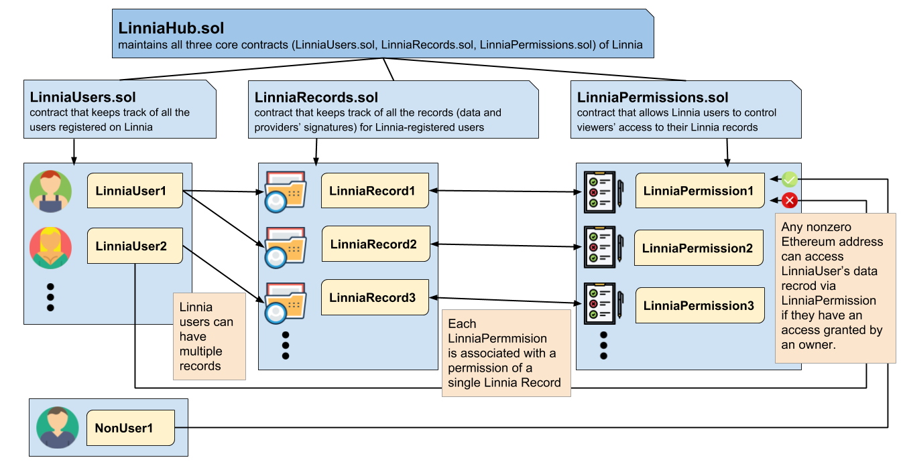
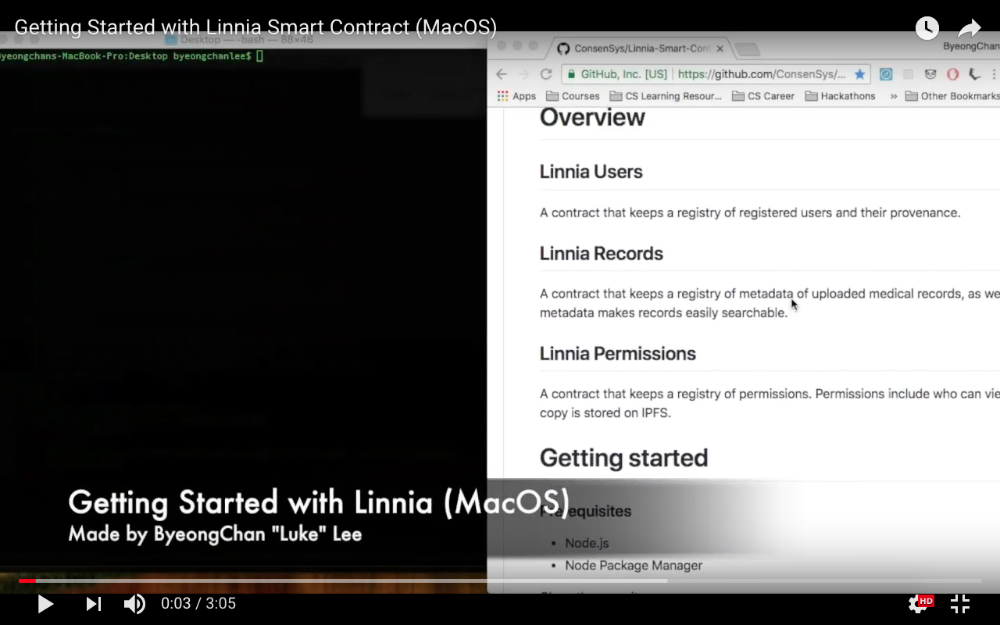

# Linnia Smart Contracts [](https://www.npmjs.com/package/@linniaprotocol/linnia-smart-contracts)  
---
> :warning: WIP

Smart Contracts for Linnia

# Overview
## Linnia Users
A contract that keeps a registry of registered users and their provenance.

## Linnia Records
A contract that keeps a registry of metadata of uploaded medical records, as well as the IRIS score of those records. The metadata makes records easily searchable.

# Recieving Tokens when adding Linnia records

When a person uploads data, 1 Finney LIN token is transferred from the Linnia admin pool/acct to the user’s address.
Currently no data validation needed.

1 Finney of LIN tokens per upload for now.

## Linnia Permissions
A contract that keeps a registry of permissions. Permissions include who can view what data, and where the permissioned copy is stored on IPFS.

## Linnia Overall Architecture 


# Getting started

### Prerequisites
* Node.js
* Node Package Manager

Clone the repository
```
$ git clone https://github.com/ConsenSys/Linnia-Smart-Contracts.git
```

Install the dependencies
```
$ npm install
```

## Deploying
```
npm run migrate
```

## Testing
To run tests with coverage
```
npm run coverage
```

To run tests without coverage
- First start testrpc with `npm start`
  - Alternatively you can run Ganache GUI at port 7545 with network id 5777
- Run `npm test`

## Video to Help You Get Started

[](https://www.youtube.com/watch?v=9RzCvB_Gvvo&t)

# Contributing

Please read [CONTRIBUTING.md](https://github.com/ConsenSys/linnia-resources/blob/master/CONTRIBUTING.md) for details on our code of conduct, and the process for submitting pull requests to us.
